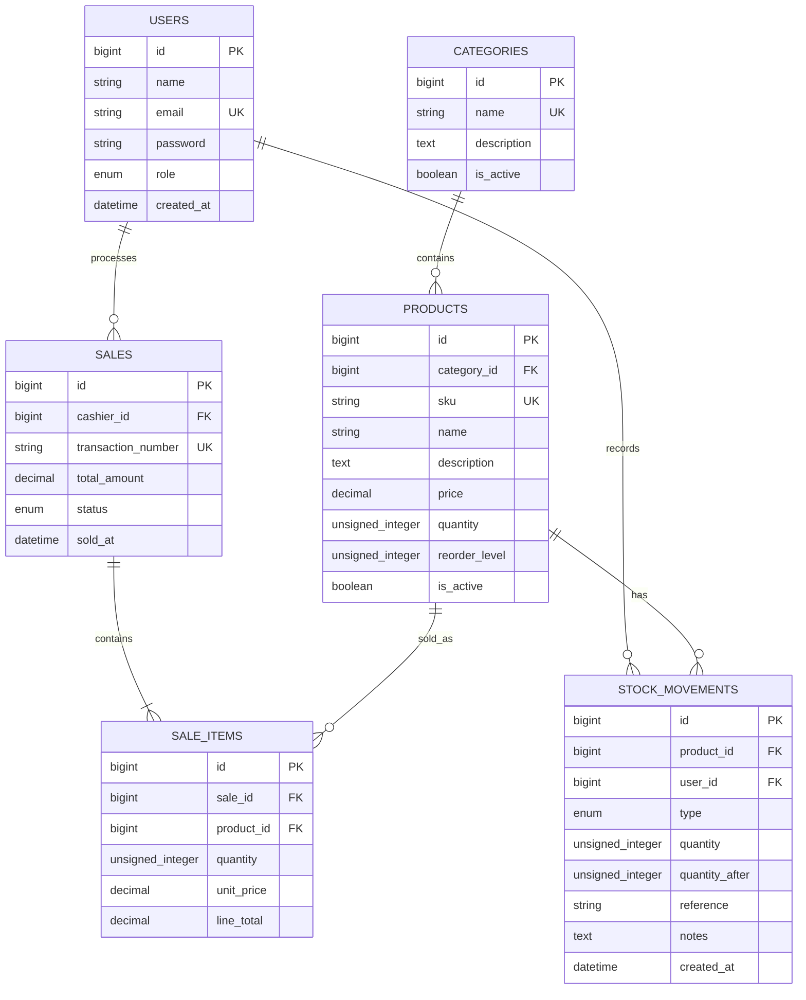

# Motorcycle Parts Inventory and Sales Management System

## Recommended architecture

A two-application monorepo keeps the Vue client and Laravel REST API independently testable while sharing one MySQL database contract.

- `frontend`: Vue 3 + Vite single-page application, Tailwind CSS, Vue Router, Axios, Chart.js.
- `backend`: Laravel 12 REST API, Sanctum token authentication, Eloquent models, Form Requests, Policies, API Resources, MySQL.
- `docs`: scope, ERD, wireframes, test plans, revisions, and user guide.
- `database`: schema is owned by Laravel migrations and seeders; do not maintain a second hand-edited schema.

Request flow: Vue page -> Axios API client -> Laravel route/controller -> Form Request + Policy -> Eloquent model/service -> MySQL -> JSON Resource.

## Folder structure

```text
/
|-- frontend/
|   |-- src/
|   |   |-- assets/
|   |   |-- components/       # reusable UI pieces
|   |   |-- layouts/          # authenticated shell and auth layout
|   |   |-- pages/            # Login, Dashboard, Products, Inventory, POS, Reports, Users
|   |   |-- router/            # route definitions and guards
|   |   |-- services/          # Axios client and API modules
|   |   |-- stores/            # auth and UI state when needed
|   |   |-- App.vue
|   |   |-- main.js
|   |   `-- style.css
|   |-- vite.config.js
|   `-- package.json
|-- backend/
|   |-- app/Models, Http/Controllers, Http/Requests, Http/Resources, Policies
|   |-- database/migrations, seeders, factories
|   |-- routes/api.php
|   |-- config/cors.php
|   `-- composer.json
|-- docs/
|   |-- PHASE-2-ARCHITECTURE.md
|   |-- ERD.md
|   `-- wireframes.md
`-- README.md
```

## Database / ERD



Inventory is derived from the product quantity plus an immutable stock movement history. Stock-in adds quantity; stock-out and a successful sale subtract quantity. POS writes the sale, sale items, product quantity, and sale stock movements inside one database transaction, and rejects insufficient stock before any write.

## Vue pages and components

Pages: `Login`, `Dashboard`, `Products`, `Categories`, `Inventory`, `StockMovements`, `POS`, `SalesHistory`, `Reports`, and `Users`.

Reusable components: `AppShell`, `Sidebar`, `Topbar`, `StatCard`, `DataTable`, `StatusBadge`, `FormModal`, `ProductSearch`, `CartPanel`, `EmptyState`, and `ConfirmDialog`.

## Laravel API structure

- `POST /api/auth/login`, `POST /api/auth/logout`, `GET /api/auth/me`
- `GET|POST|PUT|DELETE /api/products`
- `GET|POST|PUT|DELETE /api/categories`
- `GET /api/inventory`, `GET /api/stock-movements`, `POST /api/stock-movements`
- `POST /api/sales`, `GET /api/sales`, `GET /api/sales/{sale}`
- `GET|POST|PUT|DELETE /api/users` (admin only)
- `GET /api/reports/sales`, `GET /api/reports/inventory`

Controllers stay thin. Validation belongs in Form Requests, authorization in Policies or middleware, and multi-table inventory/sale updates in dedicated services with `DB::transaction()`.

## Authentication and roles

Sanctum authenticates a user after login and returns a token for the Axios client. The frontend stores only the token and basic user profile in session storage, sends `Authorization: Bearer <token>`, and redirects unauthenticated users to Login.

- Admin: products, categories, inventory, stock movements, reports, users, and sales.
- Staff: products/inventory lookup, stock movements as authorized, POS, own sales history, and reports allowed by policy.

Passwords are hashed by Laravel. No passwords or tokens are logged or committed.

## Phase 2 TODO checklist

- [x] Confirm scope, roles, deliverables, and acceptance criteria.
- [x] Scaffold Vue 3 + Vite frontend.
- [x] Scaffold Laravel REST backend.
- [x] Install Tailwind CSS, Axios, Vue Router, Chart.js, and Sanctum.
- [x] Initialize monorepo folder structure and architecture notes.
- [x] Create initial database/ERD design.
- [x] Create responsive login/navigation/dashboard/POS/inventory wireframe prototype.
- [ ] Add Laravel migrations, models, seeders, and role middleware in Phase 3.
- [ ] Connect the login prototype to Sanctum in Phase 3.
- [ ] Validate the database in MySQL and record the connection settings.

## Development commands

From the repository root:

```powershell
cd frontend
npm install
npm run dev

cd ..\backend
php artisan serve
```

Set `VITE_API_BASE_URL=http://127.0.0.1:8000/api` in `frontend/.env` when API work begins. Copy `backend/.env.example` to `backend/.env`, set the MySQL database values, and run `php artisan migrate --seed` after Phase 3 migrations exist.
